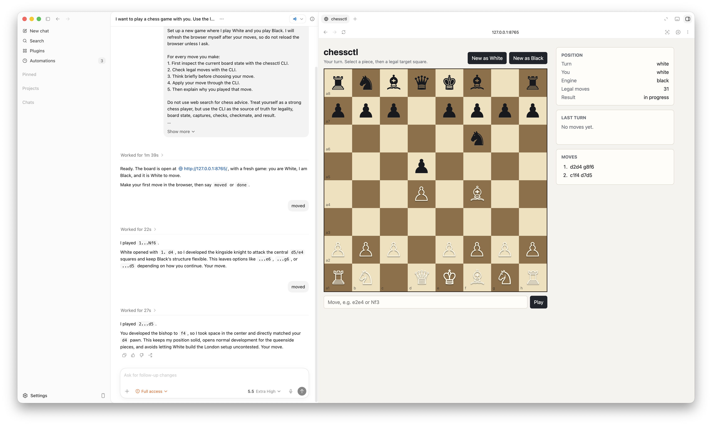

# chessctl



`chessctl` is a thin deterministic wrapper around `python-chess`, plus a small browser board for agent-driven play.

It is not a chess engine, not an LLM, and not a grand platform. It is a hobby project. Its job is closer to a linter/compiler guardrail: expose the real board state, legal moves, captures, checks, checkmate, and game outcome so an external agent cannot make illegal moves.

## Motivation

This project started from a few small questions:

1. If we apply the guardrails learned from coding tools, such as linters and compilers, to chess, can an LLM play better?
2. Can an LLM explain why it chose a move after checking the actual board state and legal moves?
3. As a later curiosity: if an agent had been fine-tuned or trained with reinforcement learning on Mikhail Tal's games, or if it had a retrieval system that could search Tal's games during play, what move would it choose in the current position?

The first step is not to build a style model. The first step is simply to make a reliable rules layer that an agent can call before it speaks or moves.

## What It Provides

- A JSON CLI for board state, legal moves, candidate move inspection, move application, and game outcome.
- A browser GUI for human moves.
- A shared local `game.json` file used by both the GUI and CLI.
- No automatic engine replies. After a human move, the board waits for an external agent to inspect the position and apply a reply through the CLI.

This is intentionally small: most chess rules are delegated to `python-chess`; `chessctl` mainly packages them into an agent-friendly CLI and local GUI loop.

## Local Game State

`game.json` is local runtime state and should not be committed. It is ignored by `.gitignore`.

To create a fresh local game:

```bash
uv run chessctl new --game game.json --force
```

To restore the tracked initial template instead:

```bash
cp examples/initial-game.json game.json
```

The tracked template is:

```text
examples/initial-game.json
```

## Install / Run

```bash
cd /Users/hahnlee/Root/exp/chessctl
uv run chessctl new --game game.json --force
uv run chessctl web --game game.json --host 127.0.0.1 --port 8765
```

Open:

```text
http://127.0.0.1:8765
```

All CLI commands print JSON. Use `--compact` when a single-line response is easier for automation.

## CLI Commands

### `new`

Create a local game file.

```bash
uv run chessctl new --game game.json
uv run chessctl new --game game.json --fen "8/8/8/8/8/8/4k3/4K3 w - - 0 1" --force
```

### `state`

Return the current board, pieces, FEN, legal move count, outcome, and PGN.

```bash
uv run chessctl state --game game.json
uv run chessctl state --fen "rnbqkbnr/pppppppp/8/8/8/8/PPPPPPPP/RNBQKBNR w KQkq - 0 1"
```

### `legal`

Return every legal move and its immediate consequences.

```bash
uv run chessctl legal --game game.json
```

Each move includes UCI, SAN, source and target squares, moving piece, capture details, castling flags, check/checkmate flags, `fen_after`, and `outcome_after`.

### `inspect`

Validate and explain one candidate move without changing `game.json`.

```bash
uv run chessctl inspect --game game.json --move Nf3
uv run chessctl inspect --game game.json --move g1f3
```

Illegal moves exit with status `2` and return a JSON error plus the legal move list.

### `apply`

Apply one legal move to `game.json`.

```bash
uv run chessctl apply --game game.json --move e2e4
```

Illegal moves are rejected and do not change the game file.

### `outcome`

Return terminal status and result.

```bash
uv run chessctl outcome --game game.json
```

### `web`

Serve the browser board.

```bash
uv run chessctl web --game game.json --host 127.0.0.1 --port 8765
```

The web API is intentionally small:

- `GET /api/state`
- `POST /api/new` with `{"human_color":"white"}` or `{"human_color":"black"}`
- `POST /api/move` with `{"move":"e2e4"}`

## Agent Workflow

For agent-driven play, follow `AGENTS.md`. The agent should never guess legal moves from memory or chess intuition.

Required move loop:

```bash
uv run chessctl state --game game.json
uv run chessctl legal --game game.json
uv run chessctl inspect --game game.json --move <move>
uv run chessctl apply --game game.json --move <move>
```

If a candidate move depends on the opponent not having a reply, inspect the candidate `fen_after` with `legal` and `inspect` before applying the move.

## License

This project is licensed under `GPL-3.0-or-later`.

That matches the current rules dependency, `chess` / `python-chess`, which reports `GPL-3.0+` in its package metadata.

## Development

```bash
uv run python -m unittest discover -s tests
```
